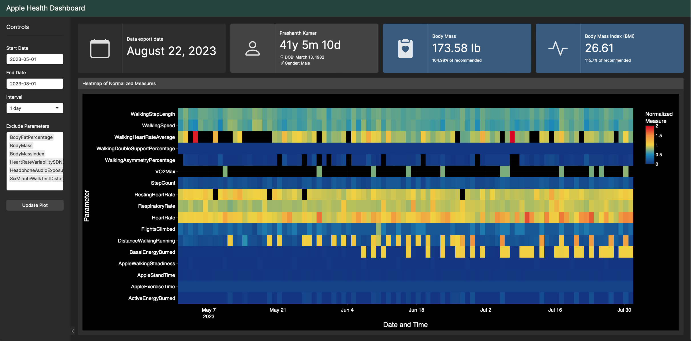

# Apple Health Dashboard

This repository contains code to create a dashboard using the Shiny framework for visualizing Apple Health data. The dashboard provides insights into various health parameters and allows users to customize their visualization experience.

## Table of Contents

- [Apple Health Dashboard](#apple-health-dashboard)
  - [Table of Contents](#table-of-contents)
  - [Introduction](#introduction)
  - [Setup](#setup)
  - [Usage](#usage)
  - [Contributing](#contributing)
  - [License](#license)

## Introduction

The Apple Health Dashboard is designed to analyze and visualize Apple Health data. It employs the Shiny framework to create an interactive web-based dashboard that allows users to explore their health metrics over time.

Key features of the dashboard include:
- Visualization of various health parameters such as body mass, body mass index (BMI), and more.
- Customizable date range and interval for data analysis.
- Ability to exclude specific parameters from visualization.
- Heatmap representation of normalized measures.


## Setup

To set up and run the Apple Health Dashboard, follow these steps:

1. Clone the repository to your local machine:

   ```sh
   git clone https://github.com/your-username/apple-health-dashboard.git
   cd apple-health-dashboard
   ```

2. Make sure you have the required R packages installed. You can install them using the following R code:

   ```r
   install.packages(c("ggplot2", "shiny", "bslib", "bsicons", "flexdashboard", "tidyverse", "ggdark", "viridis", "jsonlite", "lubridate", "plotly", "purrr"))
   ```

3. Modify the `config.json` file with your Apple Health data folder path. The `apple_health_data_folder` path in the `config.json` should be set to the folder downloaded from the GitHub repository [apple-health-data](https://github.com/prasxanth/apple-health-data). Ensure that this folder contains at least one instance of exported Apple Health data.

4. Run the Shiny app by executing the following command in your R environment:

   ```r
   shiny::runApp("path-to-apple-health-dashboard-folder")
   ```

Replace `"path-to-apple-health-dashboard-folder"` with the actual path to the cloned repository on your machine.

## Usage

1. After setting up and running the Shiny app, you will be able to access the dashboard in your web browser.




2. Use the sidebar controls to customize the dashboard's parameters:
   - **Start Date**: Choose the starting date for data visualization.
   - **End Date**: Choose the ending date for data visualization.
   - **Interval**: Select the time interval for data aggregation (e.g., 6 hours, 1 day, 1 week).
   - **Exclude Parameters**: Exclude specific health parameters from visualization.
   - **Update Plot**: Click this button to update the visualizations based on your selections.

3. Explore the different sections of the dashboard to gain insights into your health data.

## Contributing

Contributions to this repository are welcome! If you find any issues or have suggestions for improvements, feel free to open an issue or submit a pull request.

## License

This project is licensed under the [MIT License](LICENSE).

